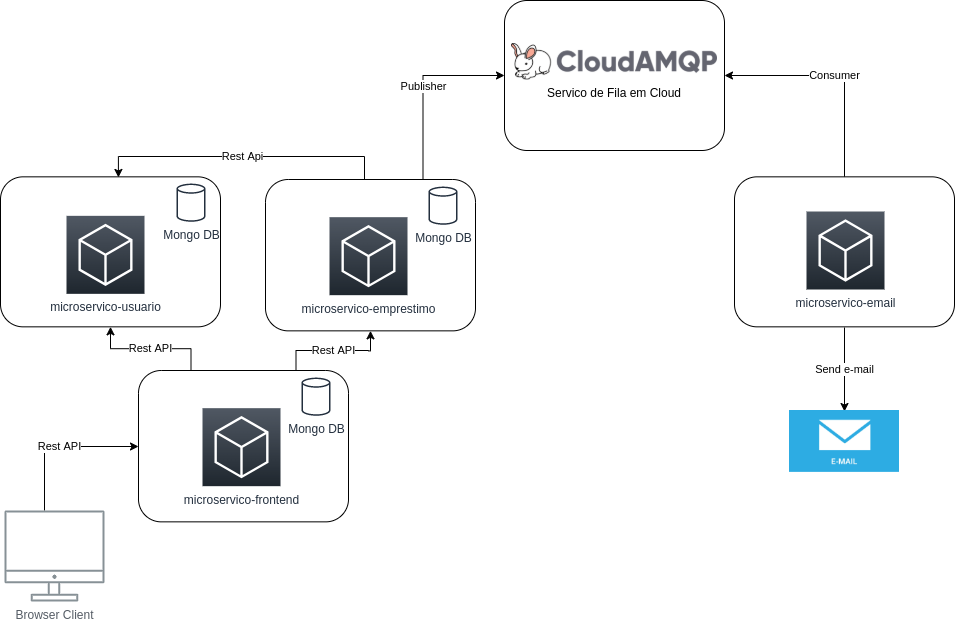

# microservice
Este repositório contém o microserviço do APP **A Grana é Nossa**. 
Também representa os trabalhos relacionados a startup one Fiap.

### Running

### Arquitetura

### Domain Story Telling

- Micro serviço de usuário: https://github.com/bruno-vieira-farias/microservice-usuario
- Micro serviço de Empréstimo: https://github.com/bruno-vieira-farias/microservice-emprestimo
- Micro serviço de envio de email: https://github.com/bruno-vieira-farias/microservice-emailsender
- Front-end em angular: https://github.com/dclimaites/microservice-frontend

#### No Front-End, utilize o usuário pré-configurado para acesso ao sistema.
 Login: `admin@admin.com`
 Senha: `admin`
 
### Run
  Para subir toda a infra-estrutura execute `docker-compose up` no diretório raiz deste projeto.
  
### Run on Docker Swarm Cluster
  Para subir toda a infra-estrutura execute `docker stack deploy -c docker-compose-swarm.yml a_grana_e_nossa` no diretório raiz deste projeto.
